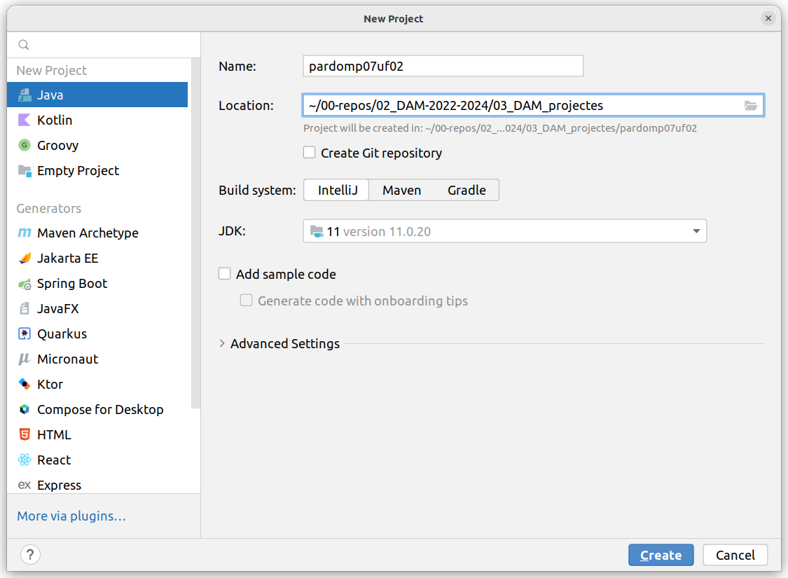
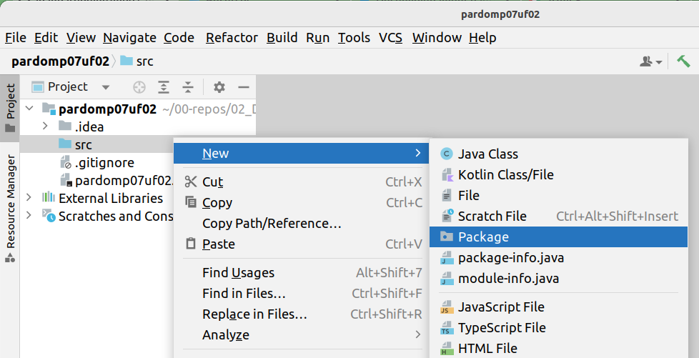
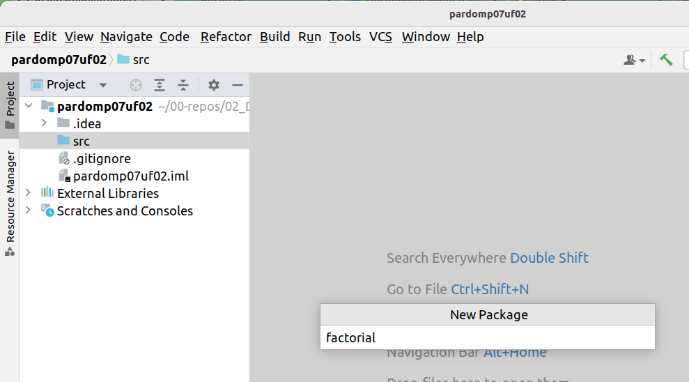
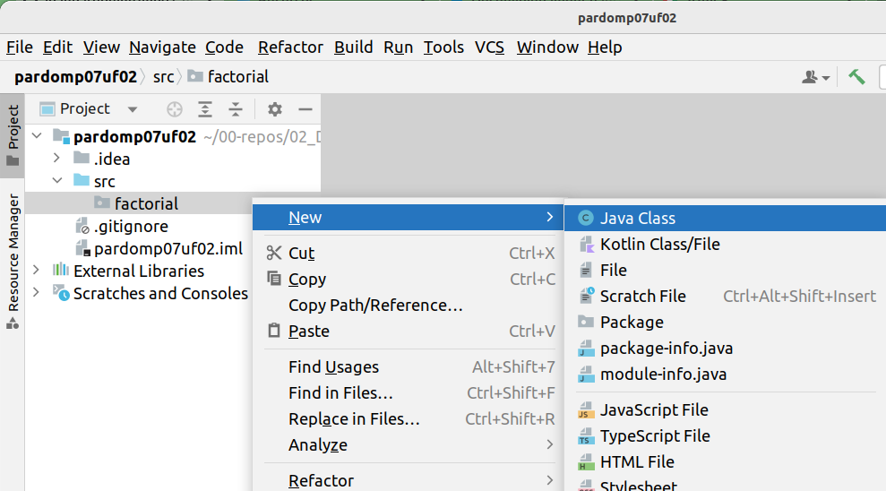
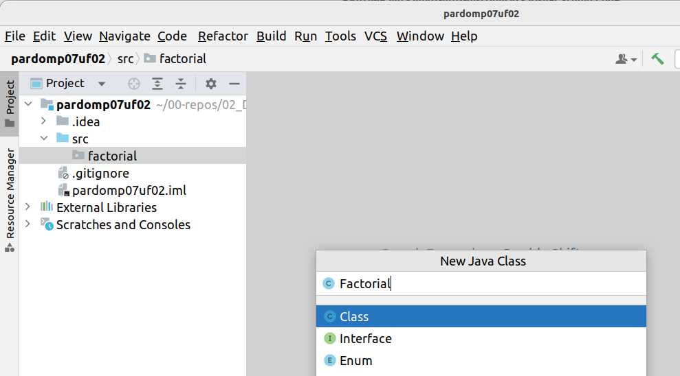
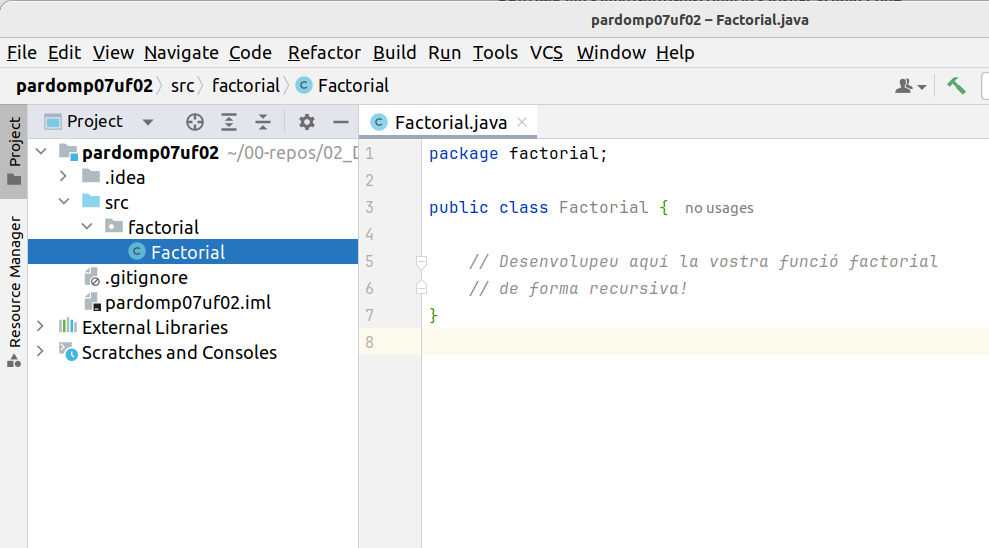

# Distribució d'aplicacions

## Implementar el factorial

L'objectiu d'aquesta activitat és desenvolupar el codi de l'exercici factorial de manera iterativa per fer-lo servir en properes activitats per executar proves de programari.

Cal implementar el codi que resolgui el problema del càlcul del factorial d'un nombre introduït per teclat. Cal resoldre l'exercici de manera iterativa.

Un cop que ja teniu creada la **Classe `Factorial`**, cal que creeu un projecte a l'**IDE** **`IntelliJ IDEA`**, el nom del projecte ha de ser   **`<CognomAlumne>mp07uf02`**, i dins del projecte la **Classe `Factorial`** cal que estigui a un paquet **`factorial`**, ja que després caldrà que exportem aquest **paquet** per poder-lo distribuir.

1. *nom del projecte:* **`<CognomAlumne>mp07uf02`**,

1. *nom del paquet:* **`factorial`**

1. *nom de la classe*: **`Factorial`**

Podeu seguir el passos als següents enllaços:

[Prepare a project](https://www.jetbrains.com/help/idea/creating-and-running-your-first-java-application.html#get-started)

[Write the code](https://www.jetbrains.com/help/idea/creating-and-running-your-first-java-application.html#write-code)

[Build and run the application](https://www.jetbrains.com/help/idea/creating-and-running-your-first-java-application.html#run_app)

[Package the application in a JAR](https://www.jetbrains.com/help/idea/creating-and-running-your-first-java-application.html#package)

[Run the packaged application](https://www.jetbrains.com/help/idea/creating-and-running-your-first-java-application.html#run_jar_artifact)

